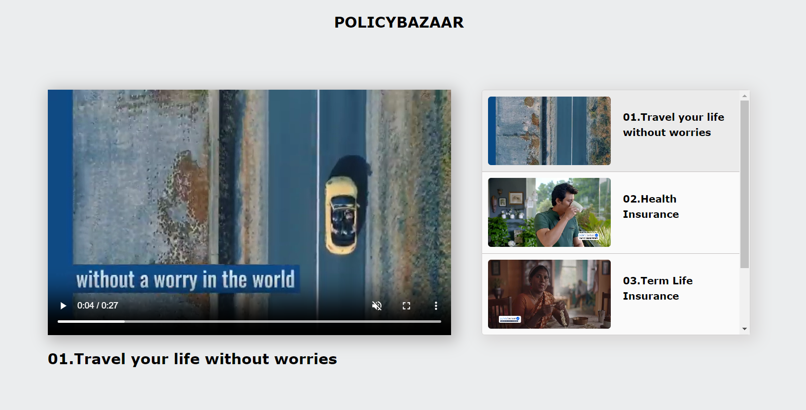

# Video Playlist

### Creating video playlist with products ads using HTML, CSS and Javascript

#### In this page, you can see how I created a video playlist like you can see on youtube playlist by step by step with html, css and Javascript. This is my beginner project, So maybe it has some mistakes in the code.

# Table of Contents
- [Step - 1 : Project setup](#step---1--project-setup)
- [Step - 2 : Let's write HTML code](#step---2--lets-write-html-code)
- [Step - 3 : Styling with CSS](#step---3--styling-with-css)
- [Step - 4 : Let's write Javascript](#step---4--lets-write-javascript)
- [Final Output](#final-output)

# Step - 1 : Project setup

Before moving on to the project, we need a IDE-Integrated development environment for a project. For this project, I use VS code. It is a popular development environment for HTML, CSS, Javascript and much more.

- Download and Install the VS code from the official site

  - VS code [download](https://code.visualstudio.com/download)

- After Finishing the Environment setup, Then create a folder with the name as Video-Playlist(any name).
  In the folder, create a new file called index.html and style.css.

  - Why index.html? -> The index. html page is the most common name used for the default page shown on a website if no other page is specified when a visitor requests the site. In other words, index. html is the name used for the homepage of the website.
  - Why style.css? -> The css file to styling the html, we can use any name for this file. I just use simply 'style.css'.

- Why simply creating two files without a folder structure?
  - Normally, If we create a frontend or any other big project, we need a folder structure to maintain and organize the project. It helps the developer in the future, when the codebase become large.
  - But, In this project we can see it is for a Simple video playlist. We don't need much code to create this form and so we don't need a folder structure.

# Step - 2 : Let's write HTML code

- After the project setup, Let's go to the index.html file
  and Type the following HTML code,

```
<!DOCTYPE html>
<html lang="en">
  <head>
    <meta charset="UTF-8" />
    <meta http-equiv="X-UA-Compatible" content="IE=edge" />
    <meta name="viewport" content="width=device-width, initial-scale=1.0" />
    <title>Video Playlist</title>
  </head>
  <body></body>
</html>
```

These code is standard to creating a any HTML page. And the 'title' tag in the head section is used to give a title to a webpage and shows as a tab name in the browser.

- Now, inside the 'body' tag type the following code.
```
 <!-- Company Name -->
    <h2 class="company-title">Policybazaar</h2>

    <!-- Video Section -->
    <section class="products">
      <!-- Main Video -->
      <div class="main-product">
        <video src="./videos/adclip.mp4" autoplay muted controls></video>
        <h2>01.Travel your life without worries</h2>
      </div>

      <!-- Video list on right side -->
      <ul>
        <li class="active">
          <video src="./videos/adclip.mp4"></video>
          <h4>01.Travel your life without worries</h4>
        </li>
        <li>
          <video src="./videos/ad-1.mp4"></video>
          <h4>02.Health Insurance</h4>
        </li>
        <li>
          <video src="./videos/ad-2.mp4"></video>
          <h4>03.Term Life Insurance</h4>
        </li>
        <li>
          <video src="./videos/ad-3.mp4"></video>
          <h4>04.Car Insurance</h4>
        </li>
      </ul>
    </section>
```
Here, you can see the company name and below is the video section which has the playlist and main video.
- In the main video section, we can see the there has a 'video' tag with 'src' attribute which has the value of video location which was present in the current repository's videos folder.
- Below the video, we can see title of the video in 'h2' tag.
- And also we can see the 'ul' tag which contains 'li' tag with 'video' and video's title.
- With this we completed the HTML code.

# Step - 3 : Styling with CSS
After create HTML structure, Now we need styling to the HTML structure.
- To make all elements to include the padding and border to its total width and height.
- By targeting the whole page, to give background color and font.
- Also target the 'video' tag and give aspect-ratio.
```
*{
    box-sizing: border-box;
}

body
{
    font-family: Verdana, Geneva, Tahoma, sans-serif;
    background-color: rgb(235, 237, 238);
}

video {
    aspect-ratio: 16/9;
}
```
- To make the playlist box which contains video list.
```
/* total video list */
ul {
    width: 100%;
    height: 75%;
    margin: 0;
    padding: 0;
    list-style-type: none;
    overflow-y: scroll;
    border: 1px solid rgb(211, 210, 210);
    border-radius: 5px;
    box-shadow: 5px 5px 25px 5px rgb(217, 215, 215);
}
```
- To align the individual video list in the playlist box correctly.
```
/* css for all individual video-list */
ul li {
    display: flex;
    justify-content: start;
    gap: 20px;
    padding: 10px;
    background-color: rgb(250, 250, 250);
    border-bottom: 1px solid rgb(196, 190, 190);
    line-height: 25px;
    cursor: pointer;
}

/* focusing only videos in the list */
ul li video {
    width: 50%;
    border-radius: 5px;
}
```
- '.active' is used tell that current active video present in the playlist is playing as main video.
```
/* used to highlight when clicking the any videos from video list */
.active {
    background-color: rgb(235, 235, 235);
}
```
- Styling the heading,
```
/* Title of the Company */
.company-title
{
    text-align: center;
    margin: 30px 0;
    text-transform: uppercase;
}
```

- styling to the video(products) section. To bring it to center and divide the area by grid.
```
/* Total video section */
.products
{
    display: grid;
    grid-template-columns: 3fr 2fr;
    width: 75%;
    margin: auto;
    column-gap: 50px;
    align-items: center;
}
```

- styling the main video section, to look bigger and gives shadow effect.
```
/* main video */
.main-product
{ 
    width: 100%;
    height: 75%;
    box-shadow: 5px 5px 25px 5px rgb(182, 180, 180);
}

.main-product video
{
    width: 100%;
    height: 100%;
    object-fit: fill;
}
```

- By targeting the 'ul' tag first child and 'ul' tag's last child.
```
/* video list's first child */
ul li:first-child {
    margin-top: 0;
}

/* video list's last child */
ul li:last-child {
    border: none;
}
```

- Gives hover effect for the seperate video list.
```
/* applies to video list when hovering */
ul li:hover
{
    background-color: rgb(240, 240, 240);
}
```

Add some breakpoints,
- To make main video and video list in single column with full width for mobile screens.
```
/* for mobile screen which has maximum length of 768px */
@media only screen and (max-width: 768px) {
    .products{
        grid-template-columns: 1fr;
        width: 100%;
    }

    ul li h3{
        margin: 10px;
    }
}
```
- To make main video and video list in single column with 80% width for medium screens like tabs.
```
/* for medium screens like tabs*/
@media only screen and (max-width: 991px) {
    .products {
        grid-template-columns: 1fr;
        width: 80%;
    }
}
```

With this we are completing the CSS styling.

# Step - 4 : Let's write Javascript
Now we need to write javascript for the video changing behaviour when clicking the video in the playlist box.

- First create the 'script' at before the end of the 'body' tag.
```
<script></script>
```
- Inside the script, Get the required elements in javascript
```
    let mainVideo = document.querySelector(".main-product");
    let videos = document.getElementsByTagName("li");
```
- In the above code, getElementsByTagName("li") returns the HTML collection of given tag. So we need to convert into array by like this:
```
let videoList = [...videos];
```

- Implement the logic to main video change and title change to clicked element's video and title.
```
    function changeVideo(element) {
      let newSrc = element.children[0].src;
      mainVideo.children[0].src = newSrc;

      let newTitle = element.children[1];
      mainVideo.children[1].innerText = newTitle.innerText;
    }
```

- Adding click event listener to all the video list which was present in the playlist box.
- And when the event occurs to the any of the list present in the playlist, the '.active' adds to that video list and removes the '.active' from old video list.
- At the end, we are calling the logic implemented function with the clickedElement as a argument.
```
    videoList.forEach((element) => {
      element.addEventListener("click", (e) => {
        let clickedElement = e.target.parentElement;
        let oldActiveElement = document.querySelector(".active");
        oldActiveElement.classList.remove("active");
        clickedElement.classList.add("active");
        changeVideo(clickedElement);
      });
    });
```

With this javascript code is completed.

# Final Output
