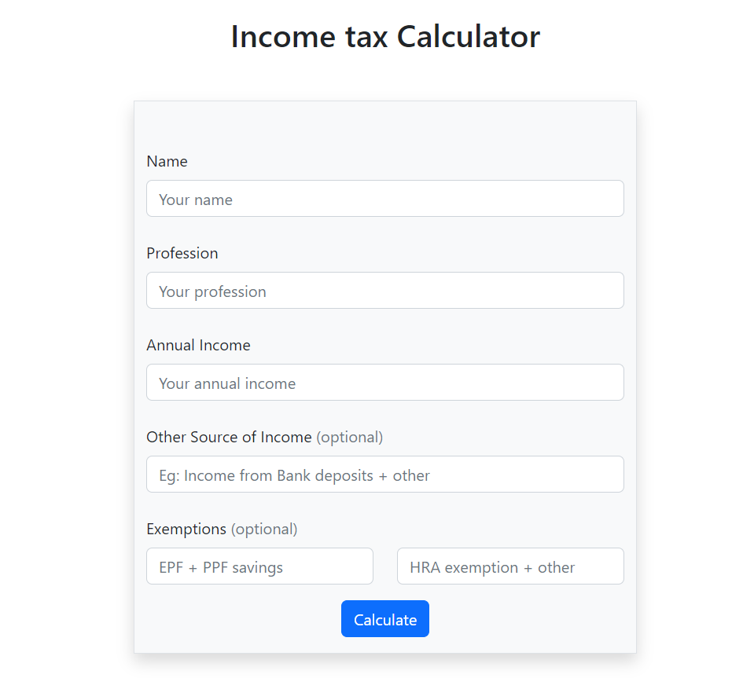

# Income Tax Calculator

### Basic Tax calculator with HTML, Bootstrap 5 and Javascript

#### In this page, you can see how I created a basic tax calculator by step by step with html, bootstrap-5 and Javascript. This is my beginner project, So maybe if it has some mistakes in the code and I will update in the future. Let's start the process to build the Tax Calculator.

##### Note:
 - This tax calculator is based on Indian tax system and not valid on other countries.
 - This calculator follows the tax regime in the year of 2022-2023.

# Table of Contents
- [Step - 1 : Learn about Income tax](#step---1--learn-about-income-tax)
  - [Fundamental](#fundamental)
    - [Slab](#slab)
    - [Exemptions](#exemptions)
    - [Deductions](#deductions)
  - [Calculation of Income Tax](#calculation-of-income-tax)
    - [Identify Income from all sources](#identify-income-from-all-sources)
    - [Calculate Net taxable income](#calculate-net-taxable-income)
    - [Compute Income Tax based on slab](#compute-income-tax-based-on-slab)
    - [Finalize Income tax](#finalize-income-tax)
- [Step - 2 : Project setup](#step---2--project-setup)
- [Step - 3 : Let's write HTML and Bootstrap](#step---3--lets-write-html-and-bootstrap)
- [Step - 4 : Implementing logic in Javascript](#step---4--implementing-logic-in-javascript)
- [Final Output](#final-output)

 # Step - 1 : Learn about Income tax
 First before creating the tax calculator, we need to have a basic knowledge about income tax.

 ## Fundamental
 Income tax is a tax charged on the annual income earned by an individual. The amount of tax paid will depend on how much money you earn as income over a financial year.Simply, when we earn income we need to pay income tax based on slabs.

 ### Slab
 Slab is a term used find the person's tax rates based on that person's Annual income.
 Slab rates:
 - Under Rs 2.5 lakh -> 0% of tax rate
 - Between Rs 2.5 lakh - Rs 5 lakh -> 5%
 - Between Rs 5 lakh - Rs 10 lakh -> 20%
 - More than 10 lakh -> 30%
   
 #### Note
 We cannot calculate taxes above 50 lakh because the tax rate changes with surcharge.
 
### Exemptions
Exemption mean freeing the tax.
There are many type of exemptions in income tax.
Here we will see only use HRA(House Rental Allowance) exemption for the calculator.

Basically, When a person get a exemption in income tax that person can deduct the exemption amount in total income based on the govt rules.
Example: 
    - Raja has total income of Rs 3,00,000 per year.
    - So, According to slab rate Rs 3,00,000 comes under the slab of 5% tax rate.
    - But he got the HRA exemption of Rs 50,000.Then the total income - Rs 50,000(HRA exemption) = 2,50,000.
    - Now he don't need to pay tax for coming under slab of 0% tax rate.

### Deductions
Deductions mean deduct or subtract the deduct amount and total income.

- In income tax, all individual can get the standard deduction = Rs 50,000
- Also, if a person has savings like EPF and PPF savings in bank or any other services, that person can get maximum of Rs 1,50,000 deduction in total income.But if the EPF and PPF savings comes under 1,50,000 then the deduct amount will be same as current savings amount.
Example: 
    - Raja has total income of Rs 6,00,000.
    - His current slab is 20% tax rate.
    - But When he has the EPF and PPF savings of 2,00,000 and so, He get the maximum deduction of 1,50,000.
    - And now he goes to slab rate of 5% tax rate.
    - But if he has PPF and EPF savings of 50,000 then the amount will deducted also 50,000 not 1,50,000.

## Calculation of Income Tax
There are four steps involved when calculating tax.Let's see one by one:

### Identify Income from all sources
Before, calculating the tax. we need to find the source of incomes.
Example:
    - Raja has Rs 4,00,000 annual salary.
    - He also has income of Rs 50,000 come from interests in bank deposits.
    - Now, His total income is Rs 4,50,000.

### Calculate Net taxable income
After finding the total income, we need to calculate the net taxable income which was when the total income comes after all the deductions.
Example: 
    - Raja has Rs 5,00,000 annual salary.
    - He also has income of Rs 50,000 come from interests in bank deposits.
    - Now, His total income is Rs 5,50,000.
    - And according standard deduction of Rs 50,000.Then he has taxable income of 5,00,000.
    - Also he has the HRA exemption of 25,000. It also deducted from the total income.
    - Now, His net taxable income = 4,75,000.

### Compute Income Tax based on slab
Now we know how to find a net taxable income of a person. With net taxable income, we will find the tax slab rates and calculate it.
- Example-1: 
  - In the before example, Raja has net taxable income of Rs 4,75,000.
  - He goes under slab of 5%.
  - Now, we need the divide the taxable amount to calculate
    - According to the slab, Under Rs 2,50,000 has no deductions. So we need to take the first Rs 2,50,000 from net taxable income.By subtracting, Rs 4,75,000 - Rs 2,50,000 = Rs 2,25,000.
    - Now we need to calculate with this Rs 2,25,000 * 0.05(decimal form of 5%) = Rs 11,250.
  - Now the tax amount, raja want to pay was Rs 11,250.
  - But According to Income Tax Act,the Rebate under Section 87A,If your net taxable income does not exceed Rs 5 lakh,we don't need to pay the tax.

- Example-2:
    - Ram has the net taxable income of Rs 12,00,000.
    - He goes under slabe of 30%.
    - Now, we need the divide the taxable amount to calculate
      - According to the slab, Under Rs 2,50,000 has no deductions.And between 2.5 lakhs and 5 lakhs has a slab of 5%. And  between 5 lakhs and 10 lakhs has a slab of 20%. So we need to calculate step by step:
      - First we need to find the amount with 5% slab.So we need to take the 5 lakh from the net taxable income,And with that 5 lakh We can find 5% by subtracting that 5 lakh with 2.5 lakh  and now the amount is 2,50,000 and now get the tax amount by 2,50,000 * 0.05 = 12,500.
      - And finally, we already get the tax amount for 5 lakh which was Rs 12,500. And now get the tax amount with slab of 20% which was calculated by following method:
        - Rs 0(tax amount for 2.5 lakh) + Rs 12,500(tax amount for 5 lakh) + Rs 1 lakh(5,00,000 * 0.2 which was 20% slab) + Rs 2 lakh * 0.3(which was 30% slab).
    - Basically, we dividing the taxable income into seperate parts which was 0% slab has Rs 0, 5% slab has Rs 12,500 and 20% slab has Rs 1,00,000. So we can use this if the amount exceeds the 20% slab, we just add all the slab amount which was 0 + 12,500 + 1,00,000 = Rs 1,12,500 is a total slab amount for upto 10 lakh. Now we can just use this like 1,12,500 + ((12,00,000(net taxable income) - 10 lakh)*0.3(decimal form of 30%)).
    - And so the tax amount of 12,00,000 is Rs 1,72,500.

### Finalize Income tax 
After finding the tax amount, we need add the CESS tax(health and education tax for public).
We can get the CESS tax by multiplying (0.04 * existing tax amount).

# Step - 2 : Project setup

Before moving on to the project, we need a IDE-Integrated development environment for a project. For this KYC project, I use VS code. It is a popular development environment for HTML, CSS, Javascript and much more.

- Download and Install the VS code from the official site

  - VS code [download](https://code.visualstudio.com/download)

- After Finishing the Environment setup, Then create a folder with the name as KYC-form(any name).
  In the folder, create a new file called index.html and index.js.

  - Why index.html? -> The index. html page is the most common name used for the default page shown on a website if no other page is specified when a visitor requests the site. In other words, index. html is the name used for the homepage of the website.
  - Why index.js? -> Basically it was the root file for all js files.

- Why simply creating two files without a folder structure?
  - Normally, If we create a frontend or any other big project, we need a folder structure to maintain and organize the project. It helps the developer in the future, when the codebase become large.
  - But, In this project we can see it is for a basic income tax calculator form. We don't need much code to create this form and so we don't need a folder structure.

# Step - 3 : Let's write HTML and Bootstrap

- After the project setup, Let's go to the index.html file
  and Type the following HTML code,

```
<!DOCTYPE html>
<html lang="en">
  <head>
    <meta charset="UTF-8" />
    <meta http-equiv="X-UA-Compatible" content="IE=edge" />
    <meta name="viewport" content="width=device-width, initial-scale=1.0" />
    <title>Income tax calculator</title>
    <link
      rel="stylesheet"
      href="https://cdn.jsdelivr.net/npm/bootstrap@5.2.3/dist/css/bootstrap.min.css"
      integrity="sha384-rbsA2VBKQhggwzxH7pPCaAqO46MgnOM80zW1RWuH61DGLwZJEdK2Kadq2F9CUG65"
      crossorigin="anonymous"
    />
  </head>
  <body></body>
</html>
```
Here except the 'link' tag which has bootstrap cdn link.
And all these code is standard to creating a any HTML page. And the 'title' tag in the head section is used to give a title to a webpage and shows as a tab name in the browser.

- Now,
  - inside the 'body' tag create a 'h1' tag for heading.
  - and a 'form' tag for nesting all form elements and a container for all the inputs.
  - Now, in the form create all required fields like name, profession, Annual income, other income, exemptions.

```
    <h2 class="text-center mt-4">Income tax Calculator</h2>
    <!-- Tax calculator form -->
    <form class="container mt-5 pt-5 bg-light border col-lg-4 shadow">
      <!-- Name -->
      <div class="mb-4 col-lg-12 m-auto">
        <label for="name" class="form-label">Name</label>
        <input
          type="text"
          class="form-control"
          id="name"
          placeholder="Your name"
        />
      </div>
      <!-- Profession -->
      <div class="mb-4 col-lg-12 m-auto">
        <label for="profession" class="form-label">Profession</label>
        <input
          type="text"
          class="form-control"
          id="profession"
          placeholder="Your profession"
        />
      </div>
      <!-- Annual Income -->
      <div class="mb-4 col-lg-12 m-auto">
        <label for="annual-income" class="form-label">Annual Income</label>
        <input
          type="number"
          class="form-control"
          id="annual-income"
          placeholder="Your annual income"
        />
      </div>
      <!-- Other Income -->
      <div class="my-4 col-lg-12 m-auto">
        <label for="other-income" class="form-label"
          >Other Source of Income
          <span class="text-muted">(optional)</span></label
        >
        <input
          type="number"
          class="form-control"
          id="other-income"
          placeholder="Eg: Income from Bank deposits + other"
        />
      </div>
      <!-- Exemptions -->
      <div class="row">
        <label class="form-label"
          >Exemptions <span class="text-muted">(optional)</span></label
        >
        <div class="col">
          <input
            type="number"
            class="form-control"
            name="epf-ppf-savings"
            id="epf-ppf-savings"
            placeholder="EPF + PPF savings"
          />
        </div>
        <div class="col">
          <input
            type="number"
            class="form-control"
            name="hra-exemption"
            id="hra-exemption"
            placeholder="HRA exemption + other"
          />
        </div>
      </div>
      <!-- Submit button -->
      <div class="text-center my-3">
        <button class="btn btn-primary" type="submit">Calculate</button>
      </div>
    </form>
    <script src="index.js"></script>
  </body>
```
Here, in the code above, It has the simple design with bootstrap and also all fields to work with logic.

# Step - 4 : Implementing logic in Javascript
Now we implement the logic step by step:
- Getting the input fields by their id.
```
// To get Client details
const name = document.getElementById("name");
const profession = document.getElementById("profession");

// To get Client Income Information
const annualIncome = document.getElementById("annual-income");
const epfPpfSavings = document.getElementById("epf-ppf-savings");
const otherIncome = document.getElementById("other-income");
const hraExemption = document.getElementById("hra-exemption");
```
- Getting the form by tag name
```
const form = document.getElementsByTagName("form");
```
- Creating a function which calculate tax 
```
// Tax calculator
function taxCalculator(taxableIncome) {
  let taxAmount = 0;

  // Taxable income under 2.5 lakhs
  if (taxableIncome <= 250000) {
    document.body.innerHTML = `<div class="card col-lg-6 col-10 m-auto mt-5">
      <div class="card-header">Mr/Ms ${name.value}</div>
      <div class="card-body">
          <p class="fs-4">You don't need to pay tax.</p>
      </div>
    </div>`;
  }
  // Taxable income under 5 lakhs(tax rate = 5%)
  else if (taxableIncome <= 500000) {
    taxAmount = (taxableIncome - 250000) * 0.05;
    document.body.innerHTML = `<div class="card col-lg-6 col-10 m-auto mt-5">
      <div class="card-header">Mr/Ms ${name.value}</div>
      <div class="card-body">
          <p class="fs-4">According to tax amount based on 5% slab:</p>
          <p class="fs-4">You have to pay ${taxAmount}.</p>
          <p class="fs-5">But According to Income Tax Act,the Rebate under Section 87A, the amount less than 5,00,000 was refundable,if you are a resident individual, but not for an NRI, Hindu Undivided Family(HUF) and firms.</p>
      </div>
    </div>`;
  }
  // Taxable income under 10 lakhs(tax rate = 20%)
  else if (taxableIncome <= 1000000) {
    // tax amount for 2,50,000 at 5%  = 12,500
    taxAmount = (taxableIncome - 500000) * 0.2 + 12500;
    document.body.innerHTML = `<div class="card col-lg-6 col-10 m-auto mt-5">
      <div class="card-header">Mr/Ms ${name.value}</div>
      <div class="card-body">
      <p class="fs-4">According to tax amount based on 20% slab:</p>
        <ul>
          <li class="fs-4">Your tax amount is ${taxAmount}.</li>
          <li class="fs-4">Plus 4% of CESS tax is ${taxAmount * 0.04}.</li>
          <li class="fs-4">Total tax amount is ${
            taxAmount * 0.04 + taxAmount
          }.</li>
        </ul>
      </div>
    </div>`;
  }
  // Taxable income under 50 lakhs(tax rate = 30%)
  else if (taxableIncome < 5000000) {
    //  tax amount for 2,50,000 at 5%  = 12,500
    //  tax amount for 5,00,000 at 20%  = 1,00,000
    //  total tax amount for 100000 = 1,12,500
    taxAmount = (taxableIncome - 1000000) * 0.3 + 112500;
    document.body.innerHTML = `<div class="card col-lg-6 col-10 m-auto mt-5">
      <div class="card-header">Mr/Ms ${name.value}</div>
      <div class="card-body">
      <p class="fs-4">According to tax amount based on 30% slab.</p>
        <ul>
          <li class="fs-4">Your tax amount is ${taxAmount}.</li>
          <li class="fs-4">Plus 4% of CESS tax is ${taxAmount * 0.04}.</li>
          <li class="fs-4">Total tax amount is ${
            taxAmount * 0.04 + taxAmount
          }.</li>
        </ul>
      </div>
    </div>`;
  }
  // More than 50 lakhs
  else {
    alert(
      "Your taxable Income is more than 50 lakhs, So you need to pay surcharge based on slab. Visit Official govt website for more details."
    );
  }
}
```
Here, we can see at first taxAmount is 0. But if any of the condition is evaluated as true, then taxAmount changed according to the condition's slab rate calculation.And View the tax information as card(bootstrap) with innerHTML which you can see inside the conditions.

- Now, Add a EventListener like when submitting the form, the given function will run.
- Event Listener are listen to the given action like "click", "submit", etc. And the when the action occurs, then the given function will run.
```
// Selecting Form and add Eventlistener onSubmit
form[0].addEventListener("submit", (e) => {
  e.preventDefault();
  let totalIncome = +annualIncome.value + +otherIncome.value;
  let grossIncome =
    totalIncome -
    +hraExemption.value -
    +(epfPpfSavings.value >= 150000 ? 150000 : epfPpfSavings.value);

  // Deduct Rs 50,000 as standard deduction
  let taxableIncome = grossIncome - 50000;
  taxCalculator(taxableIncome);
});
```
Here, We are selecting form[0], because getElementsByTagName("form") return a array.
- And inside the event listener, there has a method or function called e.preventDefault() -> It helps from stopping the page to reload when submitting.
- And in totalIncome, we are getting the values from the input fields and add their values.
- And Now getting taxableIncome by according to exemptions and EPF or PPF savings deductions and Standard deductions.
- And finally, we are passing the taxableIncome to the tax calculator to determine the taxAmount according to the slab rates.

# Final Output
